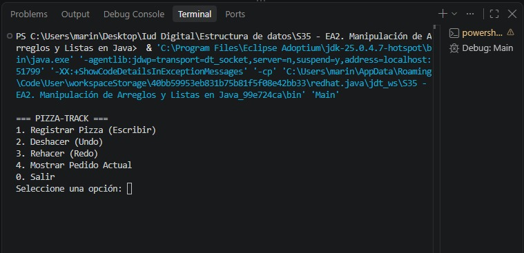
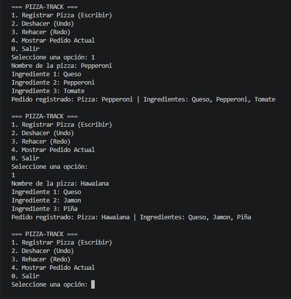
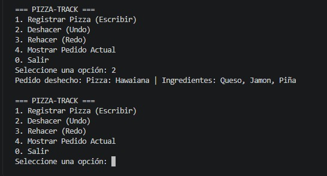
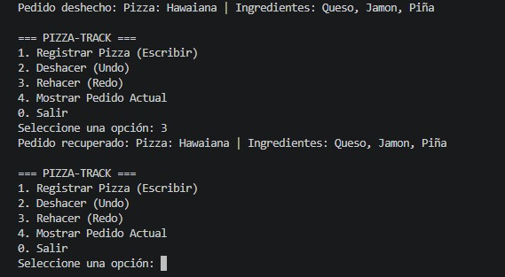

# 🍕 Pizza-Track — Gestión de pedidos con Pilas

## 1. Introducción

**Pizza-Track** es una aplicación de consola desarrollada en **Java** para simular la gestión de pedidos de una pizzería mediante la estructura de datos **pila (Stack)**.

El proyecto aplica los conceptos estudiados en las Unidades 1 y 2 de la asignatura **Estructura de Datos**, especialmente la organización y manipulación ordenada de información, las estructuras lineales, las listas ligadas, los nodos y el funcionamiento de una pila bajo el principio **LIFO (Last In, First Out)**.

La aplicación implementa manualmente la estructura de pila utilizando nodos enlazados y utiliza dos pilas para representar las operaciones de **Deshacer (Undo)** y **Rehacer (Redo)**.

---

## 2. Objetivo

### Objetivo general

Desarrollar en Java un simulador de gestión de pedidos para una pizzería mediante la implementación manual de una estructura de datos tipo pila basada en listas ligadas, aplicando el principio LIFO y las operaciones `push()`, `pop()`, `peek()` e `isEmpty()`, con el fin de gestionar los pedidos y representar las funcionalidades de deshacer (Undo) y rehacer (Redo).

### Objetivos específicos

- Comprender el concepto y funcionamiento de la estructura de datos pila.
- Identificar la aplicación del principio LIFO en la gestión de pedidos.
- Implementar una pila manual utilizando nodos y listas ligadas.
- Aplicar las operaciones `push()`, `pop()`, `peek()` e `isEmpty()`.
- Utilizar un arreglo fijo de tres posiciones para almacenar los ingredientes de cada pizza.
- Implementar dos pilas para gestionar las operaciones Undo y Redo.
- Desarrollar un menú interactivo en consola para registrar, deshacer, rehacer y consultar pedidos.
- Comprobar el funcionamiento del sistema mediante pruebas de ejecución.
- Aplicar buenas prácticas de documentación y control de versiones mediante GitHub.

---

## 3. Fundamentos teóricos

### 3.1. ¿Qué es una estructura de datos?

Una estructura de datos es una forma particular de organizar información en la memoria de un sistema para facilitar su almacenamiento, consulta y manipulación.

Las estructuras de datos permiten trabajar con la información de manera organizada y eficiente. Entre las estructuras estudiadas se encuentran arreglos, listas, pilas, colas, árboles y otras estructuras.

En este proyecto se utiliza una estructura **lineal**, específicamente una pila.

### 3.2. ¿Qué es una pila?

Una **pila (Stack)** es una estructura de datos lineal que permite almacenar y recuperar elementos siguiendo el principio **LIFO (Last In, First Out)**.

LIFO significa **“último en entrar, primero en salir”**. Por esta razón, los elementos se agregan y eliminan desde un mismo extremo de la estructura, denominado **tope**.

Por ejemplo:

```text
        TOPE
          ↓
      ┌─────────┐
      │ Pizza 3 │ ← último elemento ingresado
      ├─────────┤
      │ Pizza 2 │
      ├─────────┤
      │ Pizza 1 │ ← primer elemento ingresado
      └─────────┘
```

Si se ejecuta `pop()`, se retirará primero **Pizza 3**.

---

## 4. Implementación mediante lista ligada

La pila de este proyecto no utiliza `java.util.Stack`.

La estructura se construye manualmente utilizando una **lista ligada simple** compuesta por nodos.

Cada nodo contiene:

- Un dato, que en este caso es un objeto `Pizza`.
- Una referencia al siguiente nodo.

La estructura puede representarse así:

```text
tope
 ↓
┌──────────────┐
│ Pizza 3      │
│ siguiente ─────────┐
└──────────────┘     │
                     ↓
              ┌──────────────┐
              │ Pizza 2      │
              │ siguiente ────────┐
              └──────────────┘    │
                                  ↓
                           ┌──────────────┐
                           │ Pizza 1      │
                           │ siguiente → null
                           └──────────────┘
```

El atributo `tope` mantiene la referencia al nodo que se encuentra en la parte superior de la pila.

---

## 5. Clases del proyecto

### 5.1. `Pizza.java`

La clase `Pizza` representa cada pedido almacenado en la pila.

Cada objeto contiene:

- `nombre`: nombre de la pizza.
- `ingredientes`: arreglo fijo de tres elementos.

El arreglo se define como:

```java
String[] ingredientes = new String[3];
```

El constructor valida que la pizza tenga exactamente tres ingredientes.

Ejemplo:

```text
Pizza: Hawaiana
Ingredientes:
1. Queso
2. Jamón
3. Piña
```

---

### 5.2. `Nodo.java`

La clase `Nodo` representa un elemento de la lista ligada.

Contiene:

```java
Pizza dato;
Nodo siguiente;
```

`dato` almacena la pizza y `siguiente` mantiene la referencia al siguiente nodo.

---

### 5.3. `PilaPizza.java`

Esta clase contiene la implementación manual de la pila.

La estructura utiliza:

```java
private Nodo tope;
```

El atributo `tope` indica cuál es el nodo que se encuentra actualmente en la parte superior.

También se mantiene un contador del tamaño de la pila.

---

## 6. Operaciones de la pila

### 6.1. `push()`

El método `push()` agrega una pizza al tope.

El proceso es:

1. Crear un nuevo nodo.
2. Hacer que el nuevo nodo apunte al antiguo tope.
3. Actualizar `tope` para que apunte al nuevo nodo.
4. Incrementar el tamaño.

Representación:

```text
ANTES:

tope
 ↓
Pizza 2 → Pizza 1 → null


push(Pizza 3)


DESPUÉS:

tope
 ↓
Pizza 3 → Pizza 2 → Pizza 1 → null
```

Código utilizado:

```java
public void push(Pizza pizza) {
    if (pizza == null) {
        throw new IllegalArgumentException(
            "No se puede apilar una pizza nula."
        );
    }

    Nodo nuevo = new Nodo(pizza);
    nuevo.siguiente = tope;
    tope = nuevo;
    tamanio++;
}
```

---

### 6.2. `pop()`

El método `pop()` retira el elemento que se encuentra en el tope.

El proceso es:

1. Comprobar si la pila está vacía.
2. Guardar temporalmente la pizza del nodo superior.
3. Mover `tope` al siguiente nodo.
4. Disminuir el tamaño.
5. Retornar la pizza retirada.

Representación:

```text
ANTES:

tope
 ↓
Pizza 3 → Pizza 2 → Pizza 1 → null


pop()


DESPUÉS:

tope
 ↓
Pizza 2 → Pizza 1 → null

Pizza 3 = elemento retirado
```

---

### 6.3. `peek()`

`peek()` permite consultar el elemento ubicado en el tope sin retirarlo.

```java
public Pizza peek() {
    return isEmpty() ? null : tope.dato;
}
```

En Pizza-Track se utiliza para consultar cuál es el pedido actual listo para producción.

---

### 6.4. `isEmpty()`

`isEmpty()` permite determinar si la pila está vacía.

```java
public boolean isEmpty() {
    return tope == null;
}
```

Si `tope` es `null`, significa que no existen nodos en la pila.

---

## 7. Sistema Undo / Redo

Pizza-Track utiliza dos pilas:

### Pila principal

Contiene los pedidos activos.

```text
PILA PRINCIPAL
      ↓
   Pizza 3
   Pizza 2
   Pizza 1
```

### Pila secundaria

Contiene temporalmente los pedidos que han sido deshechos.

```text
PILA SECUNDARIA
      ↓
   Pizza 3
```

---

## 8. Funcionamiento de Undo

Cuando el usuario selecciona **Deshacer (Undo)**:

1. Se ejecuta `pop()` sobre la pila principal.
2. La pizza retirada se almacena mediante `push()` en la pila secundaria.

Ejemplo:

```text
ANTES

Principal             Secundaria

Pizza 3               vacía
Pizza 2
Pizza 1


UNDO


DESPUÉS

Principal             Secundaria

Pizza 2               Pizza 3
Pizza 1
```

De esta manera, el último pedido activo queda temporalmente almacenado para poder recuperarlo.

---

## 9. Funcionamiento de Redo

Cuando el usuario selecciona **Rehacer (Redo)**:

1. Se ejecuta `pop()` sobre la pila secundaria.
2. La pizza recuperada se agrega mediante `push()` a la pila principal.

Ejemplo:

```text
ANTES

Principal             Secundaria

Pizza 2               Pizza 3
Pizza 1


REDO


DESPUÉS

Principal             Secundaria

Pizza 3               vacía
Pizza 2
Pizza 1
```

Así se recupera el pedido que había sido deshecho.

---

## 10. Registro de una nueva pizza

La opción **1. Registrar Pizza** solicita:

1. Nombre de la pizza.
2. Ingrediente 1.
3. Ingrediente 2.
4. Ingrediente 3.

Después se crea un objeto `Pizza` y se utiliza `push()` para almacenarlo en la pila principal.

Una nueva acción de registro limpia la pila secundaria, debido a que se inicia una nueva secuencia de acciones.

---

## 11. Menú del sistema

El programa presenta el siguiente menú:

```text
=== PIZZA-TRACK ===
1. Registrar Pizza (Escribir)
2. Deshacer (Undo)
3. Rehacer (Redo)
4. Mostrar Pedido Actual
0. Salir
Seleccione una opción:
```

### Opción 1 — Registrar Pizza

Permite crear un nuevo pedido.

### Opción 2 — Deshacer (Undo)

Retira el último pedido de la pila principal y lo envía a la pila secundaria.

### Opción 3 — Rehacer (Redo)

Recupera el último pedido almacenado en la pila secundaria.

### Opción 4 — Mostrar Pedido Actual

Utiliza `peek()` para consultar el pedido ubicado en el tope sin retirarlo.

### Opción 0 — Salir

Finaliza la aplicación.

---

## 12. Estructura del proyecto

```text
Pizza-Track/
│
├── Pizza.java
├── Nodo.java
├── PilaPizza.java
├── GestionPedidos.java
├── Main.java
│
└── README.md
```

### Relación entre las clases

```text
                 Main
                  │
                  ▼
          GestionPedidos
             │       │
             ▼       ▼
       PilaPizza  PilaPizza
       Principal  Secundaria
             │       │
             └───┬───┘
                 ▼
                Nodo
                 │
                 ▼
                Pizza
```

---

## 13. Requisitos para ejecutar

- Java JDK instalado.
- Visual Studio Code recomendado por las instrucciones de la actividad.
- JDK de Eclipse Temurin.
- Terminal o consola.

---

## 14. Compilación y ejecución

Ubicarse en la carpeta donde están los archivos `.java`.

### Compilar

```powershell
javac *.java
```

### Ejecutar

```powershell
java Main
```

Si se utiliza una carpeta `src`, puede ejecutarse:

```powershell
javac -d bin src/*.java
java -cp bin Main
```

---

## 15. Prueba de funcionamiento

Para comprobar el funcionamiento del sistema se recomienda realizar la siguiente secuencia:

### Paso 1 — Registrar primera pizza

```text
Opción: 1
Nombre: Pepperoni
Ingrediente 1: Queso
Ingrediente 2: Pepperoni
Ingrediente 3: Tomate
```

### Paso 2 — Registrar segunda pizza

```text
Opción: 1
Nombre: Hawaiana
Ingrediente 1: Queso
Ingrediente 2: Jamón
Ingrediente 3: Piña
```

### Paso 3 — Consultar pedido actual

```text
Opción: 4
```

Resultado esperado:

```text
Pizza lista para producción:
Pizza: Hawaiana | Ingredientes: Queso, Jamón, Piña
```

### Paso 4 — Ejecutar Undo

```text
Opción: 2
```

Resultado esperado:

```text
Pedido deshecho:
Pizza: Hawaiana | Ingredientes: Queso, Jamón, Piña
```

### Paso 5 — Ejecutar Redo

```text
Opción: 3
```

Resultado esperado:

```text
Pedido recuperado:
Pizza: Hawaiana | Ingredientes: Queso, Jamón, Piña
```

Esta prueba permite evidenciar el ciclo:

```text
REGISTRO
   ↓
PUSH
   ↓
PILA PRINCIPAL
   ↓
UNDO
   ↓
POP PRINCIPAL
   ↓
PUSH SECUNDARIA
   ↓
REDO
   ↓
POP SECUNDARIA
   ↓
PUSH PRINCIPAL
```

---

## 16. Capturas de pantalla

### Captura 1 — Menú principal

La siguiente captura evidencia la ejecución de Pizza-Track y la presentación del menú principal.



### Captura 2 — Registro de pedidos

La siguiente captura evidencia el registro de dos pedidos de pizza, cada uno con sus tres ingredientes.



### Captura 3 — Undo

La siguiente captura evidencia la operación Deshacer (Undo), mediante la cual se retira el último pedido de la pila principal.



### Captura 4 — Redo

La siguiente captura evidencia la operación Rehacer (Redo), mediante la cual se recupera el pedido que había sido deshecho.


---

## 17. Sustentación individual

La actividad requiere una sustentación individual mediante un video de máximo 3 minutos.

Durante el video se debe:

- Realizar una presentación formal.
- Mostrar el rostro.
- Explicar la lógica de `push()`.
- Explicar la lógica de `pop()`.
- Demostrar el ciclo Registro → Deshacer → Rehacer.

### Enlace del video

**PENDIENTE DE AGREGAR:**

```text
[Enlace al video de sustentación]
```

---

## 18. Control de versiones — GitHub

El proyecto debe estar disponible en un repositorio público de GitHub.

### Repositorio

El proyecto se encuentra disponible en un repositorio público de GitHub:

[Repositorio Pizza-Track](https://github.com/andreseduardovega/S35---EA2.-Manipulaci-n-de-Arreglos-y-Listas-en-Java)
```

### Commits

Cada integrante debe contar con al menos **3 commits propios**, según las condiciones de la actividad.

Se recomienda utilizar mensajes descriptivos, por ejemplo:

```text
Commit 1: Creación de la clase Pizza y Nodo
Commit 2: Implementación de la pila manual
Commit 3: Implementación de Undo y Redo
```

Los commits deben corresponder a trabajo real realizado por cada integrante.

---

## 19. Autores

| Nombre | Rol / participación |
|---|---|
| Andrés Vega | Desarrollo, implementación y documentación |

El proyecto fue desarrollado individualmente.

Si el proyecto se desarrolla individualmente, registrar únicamente al estudiante correspondiente.

---

## 20. Conclusión

El desarrollo de Pizza-Track permite aplicar de manera práctica los conceptos de estructuras de datos estudiados durante la asignatura.

La implementación manual de la pila mediante nodos permite comprender cómo se relacionan los elementos mediante referencias y cómo se mantiene el elemento ubicado en el tope.

El principio LIFO permite gestionar los pedidos de forma que el último pedido registrado sea el primero en ser retirado durante una operación de Undo. Mediante una segunda pila se consigue conservar temporalmente los pedidos deshechos y recuperarlos mediante Redo.

De esta manera, el proyecto integra **arreglos, listas ligadas, nodos, pilas y programación en Java** en la solución de un problema práctico de gestión de pedidos.

---

## 21. Tecnologías utilizadas

- **Lenguaje:** Java
- **Entorno recomendado:** Visual Studio Code
- **JDK:** Eclipse Temurin
- **Control de versiones:** Git
- **Repositorio:** GitHub
- **Estructuras utilizadas:** Arreglo, lista ligada y pila
